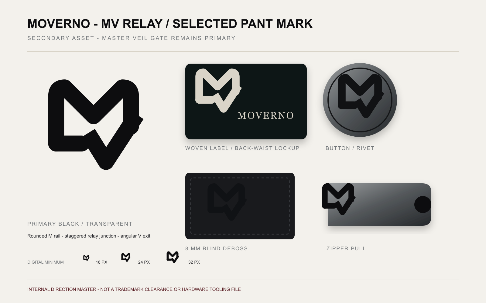

# MOVERNO / 墨维诺 SS27 裤装 Round 1

日期：2026-08-30  
当前状态：用户已回选并确认 Round 1-B `MV RELAY / 接力折线`；Round 2 的 D/E/F 全部废止。B 已完成确定性矢量、应用测试与公开近似初筛；五款纯黑裤装正侧背轮廓已生成，等待统一审核。

## 1. 已锁定的裤装系统

- 首轮五款：ARC RELAY、FORGE STACK DENIM、BREAKLINE TRACK、VEIL CARGO、NOCTURNE TAILOR。
- 黑色为共同基调，目标零售价 ¥699–999。
- 采用“统一骨架＋五个章节”：二级 MV 裤标、Relay Rail 双轨侧线和少量暗血红节点为共同资产。
- 概念阶段为 fitBlock=UNIVERSAL；保留款才开发 STRAIGHT / CURVE 与 REGULAR / LONG。
- StyTrix 仅用于项目化服装设计规范；本轮没有调用付费生成，也未消耗其点数。

## 2. 第一确认门：MV 裤标

### A — MV APERTURE / 幕隙连字

- 两侧直立笔画构成 M，中央深负形形成 V。
- 8 mm 识别、织唛和纽扣应用最稳定，与现有建筑化品牌语言最接近。
- 风险：属于较常见的直线型 MV 组合；获选后必须进一步调整开口比例、笔画端部与 V 深度，进行具体轮廓近似检查。

### B — MV RELAY / 接力折线

- 单一折带从 M 转入 V，中间只有一个错位接力节点。
- 三套中动势与差异化最强，特别适合拉链头和小型金属牌。
- 风险：8 mm 条件下接力节点可能闭合；矢量化时必须扩大内负空间并减少一次折返。

### C — MV NOTCH / 切口叠印

- 压缩叠合的 M/V 配合水平切口，工业冲压感最强。
- 适合氧化镍铆钉、皮牌压印和 PT02 重金属主款。
- 风险：缩小时先读成块状 M，跨成熟西裤与运动裤的适配性弱于 A/B。

设计推荐仍为 A；若更看重公开视觉差异和拉链五金表现，则 B 是更安全的创意备选。C 适合作为工业章节语言，但不建议单独决定全系列裤标。

## 3. 初步近似风险

MV 是服饰行业高度拥挤的字母组合。公开搜索可见美国服饰类别中的 MV 记录，以及 Mario Valentino 等相关字母图形记录；这些第三方页面只作为风险线索，不等于中国商标结论：

- https://www.trademarkia.com/mv-98413804
- https://www.indiafilings.com/search/mv-logo-tm-3557884
- https://www.mvclothing.de/en/pages/about-us
- https://mvagusta.store/pages/collection-logo-level-1

因此，本轮只用于内部方向选择。获选后必须：

1. 重建确定性矢量轮廓，不直接描摹概念图像素。
2. 对获选轮廓做反向图片检索与通用 MV 模板排查。
3. 在中国商标网及代理人检索中覆盖第 25、35 类；裤标扩展为独立五金销售前再评估第 18、14 类。
4. 完成上述检查前，不制作量产后腰牌、纽扣、铆钉或公开投放。

## 4. 概念板验收

- 恰好三套大标志，分别为建筑负形、连续折带和工业切口，不是同一图形的粗细变体。
- 每套均包含 8 mm、织唛、后腰牌、纽扣/铆钉和拉链头应用。
- 没有裤装、人物、场景、三条纹、三叶草、双 C、LV 式叠字、十字、皇冠、盾牌、武器或 tribal 装饰。
- 当前 8 mm 图示只验证视觉趋势；真正最小尺寸测试必须在获选标矢量化后重新执行。

## 5. 生成提示词摘要

Use case: logo-brand。为 MOVERNO 生成二级 MV 裤标 Round 1，只把现有 Veil Gate、MOVERNO 字标和 V2 作为家族关系参考。输出 1536×1024 三列黑白方案板：

- A MV APERTURE：建筑化 M 外结构与中央 V 形负空间。
- B MV RELAY：一根连续折带从 M 经错位接力节点转为 V。
- C MV NOTCH：带矩形切口的压缩叠合 M/V 工业印记。

每套同时展示大图、8 mm 测试、织唛、MOVERNO 后腰牌、纽扣/铆钉与拉链头；同列应用必须复用同一标志。禁止服装、人物、场景、LV、双 C、GG、FF、三角牌、BB、三叶草、三条纹、Thug Club、Chrome Hearts、十字、皇冠、盾牌、武器、翅膀、蝴蝶、骷髅、tribal 与哥特字。

## 6. Round 1 阶段结论

用户在首轮没有立即选择，并要求追加工业暗黑方案；完成 Round 2 后，用户明确回选 Round 1-B `MV RELAY / 接力折线`。因此 A/C 归档，B 成为裤装唯一二级标志方向。

## 7. 工业暗黑 Round 2

### D — MV SHEAR LOCK / 剪切锁

- 两块错位重板由单一斜向剪切分开，负空间优先读作向上运动的 V，阶梯端部在第二眼形成 M。
- 三套中潮流感、动势和隐藏字母关系最强，适合后腰牌、牛仔金属件和 PT02 强烈主款。
- 风险：大面积应用具有较强图形冲击；成熟西裤上应缩小并改为同色压印。

### E — MV RAIL CLAMP / 轨道夹

- 两条非等宽纵轨由斜向夹持件连接，强调工业装配、轨道和移动；明确避开三条纹结构。
- 与 Relay Rail 裤侧语言的系统关联最直接，适合拉链头、侧缝小牌和 PT03 运动裤。
- 风险：轮廓在第一眼可能偏向 H；若获选，矢量化时需强化下部 V 形负空间。

### F — MV BLACK FOUNDRY / 铸隙印

- 四片压铸碎块、缺角和中央深缝构成隐性 M/V，具有重铸、断裂和黑色工坊质感。
- 三套中最像独立时装符号，压印和织唛稳定，适合 Cargo 与成熟西裤。
- 风险：必须保持开放碎片关系，避免矢量化后收拢为盾牌或游戏阵营徽记。

### QA 与归档

- 方案板为 1536×1024 RGB；SHA-256：`822E6D85F45BD983EE0855B1802F2DC3D0E16C34B44F8A3CA52CD745376C7BC5`。
- 大标、8 mm 压印、织唛、后腰牌、纽扣/铆钉和拉链头按列复用同一符号；应用图仅验证气质与缩放趋势。
- 没有生成裤装、模特或场景；未使用 StyTrix 付费生成，也未消耗其点数。
- D / E / F 都不直接作为生产、五金开模或商标申请文件；获选后仍需确定性矢量重建、小尺寸测试和近似检索。

## 8. Round 2 结论

D / E / F 均被用户否决，不进入裤装、矢量化、五金或公开物料。方案板仅保留为探索轨迹。

## 9. 已选标志：B — MV RELAY

- 确定结构：上部圆角 M 轨、单一错位接力节点、下部锐利 V 出口；`Veil Gate` 继续作为主品牌门徽。
- 已输出纯黑/反白 SVG、2400×2400 透明 PNG、16/24/32/94px 测试、应用校样及三页 PDF。
- 16px 可读但接力节点开始压缩；数字端推荐不低于 24px。8mm 只作为概念下限，真实五金必须按材料补偿后打样。
- 公开搜索未发现完全相同的“圆角 M＋错位 V”轮廓，但 MV 字母组合、服饰品牌与现成模板高度拥挤，风险暂定中高；这不是中国第 25/35 类商标核准。
- 风险线索：https://www.mvclothing.de/en/pages/about-us · https://www.maivus.com/ · https://myvibeofficial.com/pages/about-us-meet-myvibe-apparel · https://dribbble.com/tags/mv-logo-design · https://scalebranding.com/product/184843

## 10. 五款纯黑轮廓 Round 1

### PT01 — ARC RELAY

- 弧形宽腿、深裆与宽裤脚；PT01 首稿的收口桶形已经废止，当前图为宽裤脚修订版。

### PT02 — FORGE STACK DENIM

- 油黑丹宁、弧形膝部裁片、轻微喇叭和受控堆脚，是唯一强重金属主款的轮廓基础。

### PT03 — BREAKLINE TRACK

- 蓝黑宽松直筒、隐藏抽绳弹力腰与轻微裤脚折量；避免三条纹和明显运动校服感。

### PT04 — VEIL CARGO

- 微桶形、双层浮袋、膝部活动量与可调裤脚；功能体积克制，不做外骨骼或军装复刻。

### PT05 — NOCTURNE TAILOR

- 梅紫黑高腰单褶、宽直腿和完整裤长，是五款中最成熟安静的一款。

## 11. 当前确认门

本轮只确认五款轮廓：腰高、裆深、臀腿量、裤脚、堆脚、口袋体积与鞋面覆盖。用户可逐款确认或提出单项修改；五款全部确认前，不加入 Relay Rail、V2 变化、MV RELAY 裤标或复杂五金。
